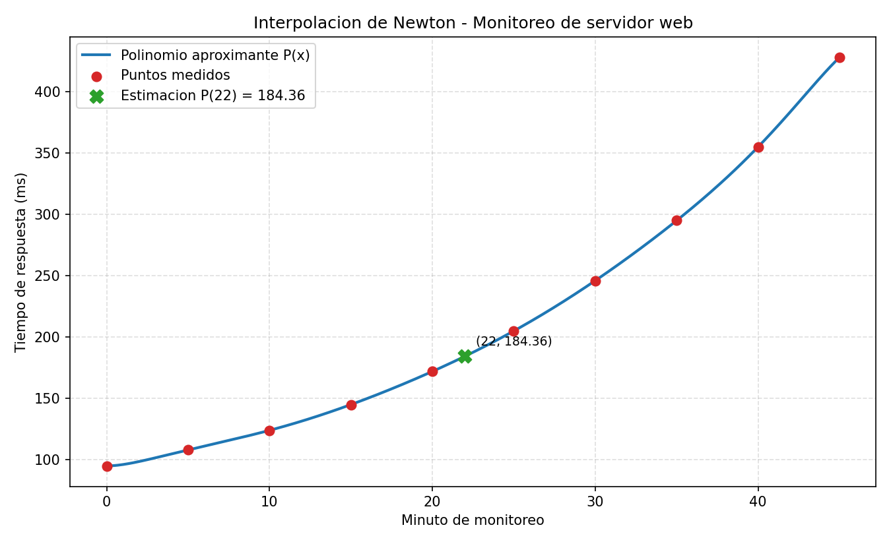

# Interpolación de Newton con Diferencias No Divididas

### María Cecilia Corazza, Melina Navarro

---

## Concepto de interpolación

Dado un conjunto de puntos de una función

$$ (x_0, y_0), (x_1, y_1), \dots\, (x_n, y_n)$$

la interpolación es un procedimiento de aproximación de un conjunto de $$n$$ puntos con un polinomio de grado $$n-1$$, ese polinomio cumple con la condición de que es único y debe pasar exactamente por todos los puntos dados.

## Conceptos matemáticos

### Diferencias hacia adelante

$$\Delta y_i = y_{i+1} - y_i \quad\text{(orden 1)}$$
$$\Delta^2 y_i = \Delta y_{i+1} - \Delta y_i \quad\text{(orden 2)}$$
$$\Delta^k y_i = \Delta^{k-1} y_{i+1} - \Delta^{k-1} y_i \quad\text{(orden } k\text{)}$$

### Diferencias hacia atrás

$$\nabla y_i = y_i - y_{i-1} \quad\text{(orden 1)}$$
$$\nabla^2 y_i = \nabla y_i - \nabla y_{i-1} \quad\text{(orden 2)}$$
$$\nabla^k y_i = \nabla^{k-1} y_i - \nabla^{k-1} y_{i-1} \quad\text{(orden k)}$$

Para simplificar la fórmula se hace un cambio de variable que mide a cuántos pasos h está el punto buscado respecto del nodo de referencia:

- Hacia adelante (referencia $x_0$): $\quad s = \dfrac{x - x_0}{h}$
- Hacia atrás (referencia $x_n$): $\quad s = \dfrac{x - x_n}{h}$

### Fórmula de Newton hacia adelante

$$P(x) = y_0 + s\,\Delta y_0 + \frac{s(s-1)}{2!}\,\Delta^2 y_0 + \frac{s(s-1)(s-2)}{3!}\,\Delta^3 y_0 + \dots$$

### Fórmula de Newton hacia atrás

$$P(x) = y_n + s\,\nabla y_n + \frac{s(s+1)}{2!}\,\nabla^2 y_n + \frac{s(s+1)(s+2)}{3!}\,\nabla^3 y_n + \dots$$

# Aplicación de Ingeniería
## Problema: monitoreo de un servidor web bajo prueba de carga
Una de las métricas clave en el manejo de servidores es el tiempo de respuesta promedio (la latencia, medida en milisegundos): cuánto tarda el servidor en contestar una petición. A medida que aumenta la cantidad de peticiones, el servidor se satura y el tiempo de respuesta crece cada vez más rápido.

Esta métrica no se puede medir todo el tiempo: el sistema de monitoreo toma muestras a intervalos regulares (por ejemplo, cada 5 minutos), no de forma continua. Este programa busca responder:
- **Interpolación**: ¿Cuál fue el tiempo de respuesta en un minuto intermedio que no se midió (por ejemplo, el minuto 22)?
- **Extrapolación (predicción)**: ¿Qué tiempo de respuesta se puede esperar un poco más allá del último instante medido (por ejemplo, el minuto 47), si la tendencia se mantiene? Esto sirve para anticipar cuando el servidor superara un umbral de latencia aceptable y decidir si escalar recursos.
Durante una prueba de carga de 45 minutos se registró, cada 5 minutos, el tiempo de respuesta promedio del servidor. Se obtuvieron 10 puntos igualmente espaciados (h = 5 minutos):

| Minuto | 0 | 5 | 10 | 15 | 20 | 25 | 30 | 35 | 40 | 45 |
|--------|----|----|----|----|----|----|----|----|----|----|
| Tiempo de respuesta (ms) | 95 | 108 | 124 | 145 | 172 | 205 | 246 | 295 | 355 | 428 |

Los datos son crecientes y con curvatura cada vez más pronunciada, lo que refleja un servidor que se aproxima a la saturación: al principio la latencia sube despacio y hacia el final se dispara. Estas 10 mediciones son exactamente el dataset de ejemplo que trae el programa (opción `ejemplo`) y también están disponibles en el archivo `datos_ejemplo.csv` (opción ‘archivo’).

**Resultado**

Estimando el minuto 22 con el método hacia adelante, el polinomio devuelve:

$$P(22) \approx 184.36 \text{ ms}$$

un valor coherente porque cae entre las mediciones del minuto 20 (172 ms) y del minuto 25 (205 ms). El gráfico siguiente muestra los 10 puntos medidos, el polinomio aproximante $P(x)$ que pasa exactamente por todos ellos, y la estimación obtenida:

# Estructura del Proyecto

El programa consta de las siguientes funciones matemáticas:

- `calcular_paso`: Valida el espaciamiento y devuelve el paso h.
- `newton_adelante`: Evalúa utilizando diferencias hacia adelante.
- `newton_atras`: Evalúa utilizando diferencias hacia atrás.

Para hacer el programa interactivo y manejar correctamente los errores, el programa tiene las siguientes funciones:

- `pedir_entero`: Lee un entero. Si ocurre un error, vuelve a intentar.
- `pedir_flotante`: Lee un decimal. Si ocurre un error, vuelve a intentar.
- `pedir_opcion`: Lee una opción dentro de una lista permitida.
- `cargar_datos_manual`: Le permite al usuario cargar puntos (x, y) con los que trabajará el programa.
- `cargar_datos_ejemplo`: Carga un ejercicio de ejemplo resuelto por la cátedra.

Para mostrar los datos una vez realizados los cálculos:

- `construir_tabla_diferencias`: Arma la tabla de diferencias no divididas.
- `imprimir_tabla`: Muestra la tabla en la terminal donde se está ejecutando el código.

# Funcionamiento del programa

## Función `calcular_paso`

Es la función de validación. Recibe la lista de nodos x y un margen de tolerancia para evitar errores de redondeo de los números decimales.
Controla tres cosas:

1. Si hay menos de 2 puntos, lanza un error. No se puede interpolar con 1 punto.
2. Calcula h = x[1] - x[0] (el primer paso) y verifica que no sea muy cercano a cero (abs(h) < tolerancia). Si esta verificación falla, significa que los dos primeros puntos son iguales.
3. Recorre el resto de los nodos comparando cada paso real x[i] - x[i-1] contra h. Si en algún tramo la diferencia supera la tolerancia, la distancia entre cada punto no es la misma y lanza un error, detallando dónde falló el programa.

Si se cumple todo lo anterior, la función devuelve h.

## Función `construir_tabla_diferencias`

Construye el triángulo de diferencias finitas como una matriz cuadrada nxn, inicializada en ceros.
Primero copia los valores originales en la columna 0: tabla[i][0] = y[i]
Después llena las columnas de orden creciente con un doble bucle for.
El índice j es el orden de la diferencia (1, 2, 3…) y el índice i la fila.
Se calcula tabla[i][j] = tabla[i+1][j-1] - tabla[i][j-1]: cada diferencia de orden j es la resta de dos diferencias consecutivas del orden anterior. A medida que sube el orden, hay una diferencia menos disponible (con 5 puntos hay 4 diferencias de orden 1, 3 de orden 2, etc.), por eso el triángulo se angosta hacia abajo. Al terminar, tabla[i][j] contiene exactamente Δyij.
Función imprimir_tabla

Usa f-strings con formato de ancho fijo (>{ancho}) para que las columnas queden alineadas.

Arma primero el encabezado: los nombres de x e y, y luego genera dinámicamente las etiquetas Δ^1y, Δ^2y, … según la cantidad de puntos. Después imprime una línea de guiones del mismo largo.

Finalmente recorre las filas: para cada fila i imprime el x y el y, y solo las diferencias que existen en esa fila. Los parámetros nombre_x y nombre_y permiten personalizar los encabezados de la tabla.

## Función `newton_adelante`

Evalúa el polinomio con la fórmula hacia adelante. Primero calcula s = (valor - x[0]) / h, que mide a cuántos pasos h está el punto buscado desde el primer nodo.
El resultado empieza en tabla[0][0] (que es y0) y se le van sumando términos. La variable producto acumula el numerador de cada coeficiente: empieza en 1.0 y en cada vuelta se multiplica por (s - (j-1)). Así, en la iteración j=1 vale s, en j=2 vale s(s-1), en j=3 vale s(s-1)(s-2), y así sucesivamente.
Cada término completo es ese producto por la diferencia correspondiente tabla[0][j] (la primera fila de la tabla, que son las Δy0j) dividido por factorial(j).

Devuelve el resultado y la variable s.

## Función `newton_atras`

Es la versión regresiva (descendente), pensada para cuando el punto está cerca del final o cuando querés extrapolar hacia adelante en el tiempo. Es simétrica a la anterior pero con tres diferencias:

s = (valor - x[-1]) / h se mide desde el último punto. El resultado arranca en tabla[n-1][0] (yₙ).

## Función `pedir_entero`

Pide al usuario un numero entero. Si el usuario escribe algo que no es un entero, int() lanza ValueError, se captura, se avisa y se vuelve a pedir sin terminar el programa. Además, si se pasa un número minimo, valida que el número no sea menor que ese piso. Solo devuelve cuando la entrada es válida.

## Función `pedir_flotante`

Igual que la anterior función pero para decimales: repite hasta que se ingrese un número decimal válido. Lo usamos para los valores de x, de y y para el instante a estimar.

## Función `pedir_opcion`

Lee una opción de texto de una lista permitida, sin distinguir mayúsculas. Normaliza las opciones válidas a minúsculas una sola vez, y en el bucle limpia la respuesta con .`strip().lower()` antes de compararla. Si no coincide con ninguna opción, avisa mostrando las válidas y reintenta sin termina el programa. Lo usamos para los menús ejemplo/manualy adelante/atras.

## Función `cargar_datos_manual`

Pide la cantidad de puntos (mínimo 2) y luego, en un bucle, cada par (x, y). Tiene una protección contra nodos repetidos: si el xi ingresado ya está en la lista, avisa y sigue pidiendo un valor distinto con un bucle hasta que sea nuevo. Devuelve las dos listas x e y.

## Función `cargar_datos_ejemplo`

Devuelve un dataset de ejemplo e imprime la tabla de datos. Sirve para probar el programa sin tener que cargar nada a mano. El ejemplo utilizado es un ejercicio resuelto por la cátedra.

## Función `main()`

Es la función principal, es decir, la que ejecuta todas las anteriores. La secuencia es:

1. elegir origen de datos (menú ejemplo/manual)
2. cargar los datos
3. validar el paso con `calcular_paso` dentro de un `try/except` (si los datos son inválidos, muestra el error y termina el programa)
4. construir la tabla
5. pedir el instante a estimar
6. avisar si ese valor cae fuera del rango medido
7. elegir el método
8. calcular con `newton_adelante` o `newton_atras`
9. imprimir el paso, la tabla, `s` y el resultado.

# Bibliografía Consultada

Consultamos el material provisto por la cátedra y fuentes externas, detalladas a continuación.

- [UNAM — Polinomios interpolantes (Newton-Gregory avance y retroceso)](https://www.ingenieria.unam.mx/pinilla/PE105117/pdfs/tema4/4-2_polinomios_interpolantes.pdf)
